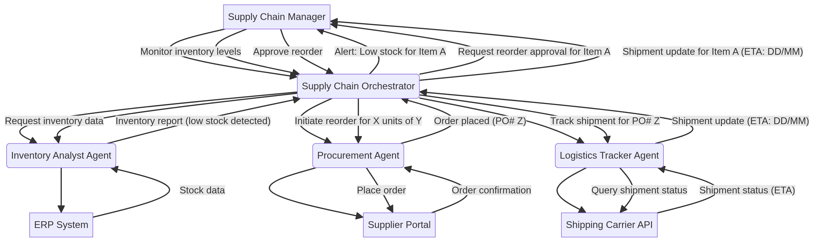

# Smart Supply Chain Orchestrator: Architecture Guide

## 1. Introduction
This document details the architectural design of the **Smart Supply Chain Orchestrator**, a system built using the principles of the Kore.ai agentic architecture. The system is designed to automate and optimize supply chain operations, including inventory monitoring, procurement, and logistics tracking.

## 2. Architectural Pattern
The system employs the **Supervisor Pattern** [1], a centralized command and control structure. In this pattern, a central orchestrator agent manages the workflow, delegating specific tasks to specialized worker agents. This approach ensures clear oversight, traceability, and coordinated execution of complex, multi-step processes.

## 3. System Components

### 3.1. Supervisor Agent: Supply Chain Orchestrator
The `Supply Chain Orchestrator` acts as the central brain of the system. Its responsibilities include:
- Receiving triggers (e.g., scheduled checks or user requests).
- Decomposing the overall goal into subtasks.
- Delegating tasks to the appropriate specialized agents.
- Aggregating results from specialized agents.
- Managing human-in-the-loop approvals for critical actions (e.g., placing large orders).
- Providing final status updates to the user.

### 3.2. Specialized Worker Agents
The system utilizes three specialized agents, each focused on a specific domain:

1.  **Inventory Analyst Agent**:
    *   **Role**: Monitors stock levels and identifies items that have fallen below their defined thresholds.
    *   **Tools**: Interacts with the ERP system to retrieve current inventory data.

2.  **Procurement Agent**:
    *   **Role**: Manages supplier interactions, obtains quotes, and places orders.
    *   **Tools**: Interacts with the Supplier Portal to fetch pricing and lead times, and to execute purchase orders.

3.  **Logistics Tracker Agent**:
    *   **Role**: Tracks the status of shipments and provides estimated times of arrival (ETAs).
    *   **Tools**: Interacts with the Shipping Carrier API to retrieve tracking information based on purchase order numbers.

### 3.3. External Systems (Mocked)
The agents interact with simulated external systems to perform their tasks:
-   **ERP System**: Provides inventory data (stock levels, thresholds, prices).
-   **Supplier Portal**: Provides supplier quotes (prices, lead times) and accepts purchase orders.
-   **Shipping Carrier API**: Provides shipment tracking status and ETAs.

## 4. Workflow Example: Automated Inventory Replenishment

1.  **Trigger**: The `Supply Chain Orchestrator` initiates an automated inventory check.
2.  **Inventory Analysis**: The Orchestrator delegates the task to the `Inventory Analyst Agent`, which queries the ERP system and identifies items with low stock.
3.  **Procurement Planning**: For each low-stock item, the Orchestrator tasks the `Procurement Agent` to find the best quote from the Supplier Portal.
4.  **Approval (Human-in-the-Loop)**: The Orchestrator presents the best quote to the user (Supply Chain Manager) and requests approval to place the order.
5.  **Order Execution**: Upon approval, the Orchestrator instructs the `Procurement Agent` to place the order, generating a Purchase Order (PO) number.
6.  **Logistics Tracking**: The Orchestrator tasks the `Logistics Tracker Agent` to monitor the shipment using the PO number.
7.  **Status Update**: The Orchestrator provides a final update to the user, including the order confirmation and ETA.

## 5. Diagram

## 6. References
[1] Kore.ai. "Choosing the right orchestration pattern for multi-agent systems." Kore.ai Blog. https://www.kore.ai/blog/choosing-the-right-orchestration-pattern-for-multi-agent-systems

**Note on Diagram Rendering:** The architectural diagram was designed using Mermaid syntax and is included in the project as `smart_supply_chain_orchestrator_architecture.mmd`. Due to current tool limitations, the PNG image could not be reliably rendered within the environment. Users can render this `.mmd` file using any Mermaid-compatible renderer to visualize the architecture.
